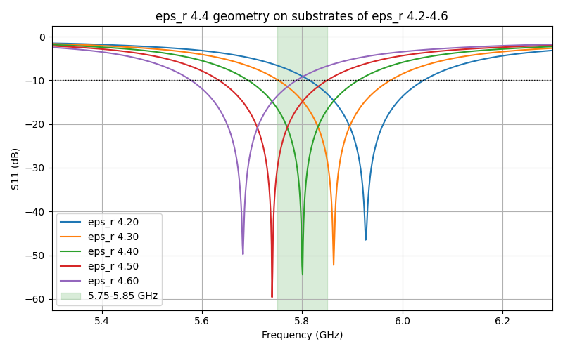

# eps_r sweep, fixed geometry (K8 calibration curve)

Generated by `sweep_eps_r.py`, do not edit by hand. Per-run plots and logs in `sweep/`.

One geometry in every row: the eps_r 4.40 design from `results.md` (patch L
11.842 mm, W 15.728 mm, inset 3.700 mm, line 2.868 mm), on one shared mesh.
Only the substrate's eps_r changes. FR4 dielectric h 1.500 mm, tan d 0.020.

| eps_r | S11 min at (GHz) | S11 min (dB) | -10 dB band (GHz) | worst over 5.75-5.85 GHz (dB) | Dmax (dBi) |
|---|---|---|---|---|---|
| 4.20 | 5.927 | -46.5 | 5.815-6.043 | -6.6 | 8.1 |
| 4.30 | 5.863 | -52.2 | 5.753-5.976 | -9.8 | 8.0 |
| 4.40 | 5.801 | -54.5 | 5.693-5.912 | -16.4 | 8.0 |
| 4.50 | 5.740 | -59.6 | 5.634-5.850 | -10.0 | 8.0 |
| 4.60 | 5.682 | -49.8 | 5.579-5.789 | -6.8 | 7.9 |

Slope (linear fit): -61 MHz per +0.1 eps_r.

Reading a measurement: `python sweep_eps_r.py --measured <GHz>` interpolates this table
(no new simulation), and prints the guide's formula
`eps_r ~ 4.4 * (f_sim / f_meas)^2` (f_sim = 5.801 GHz) as a cross-check.

