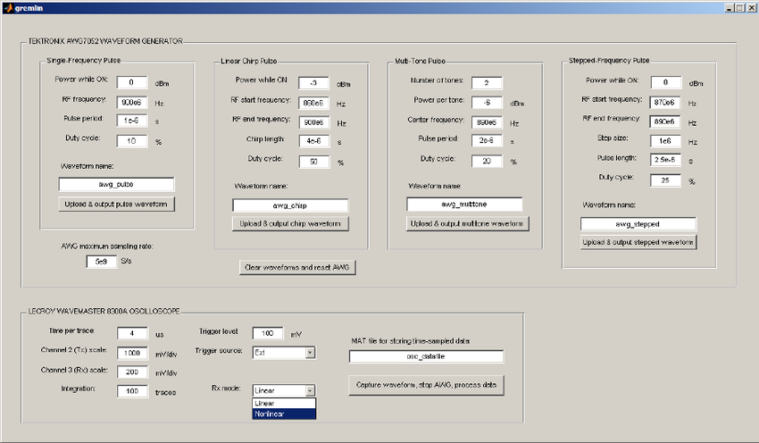
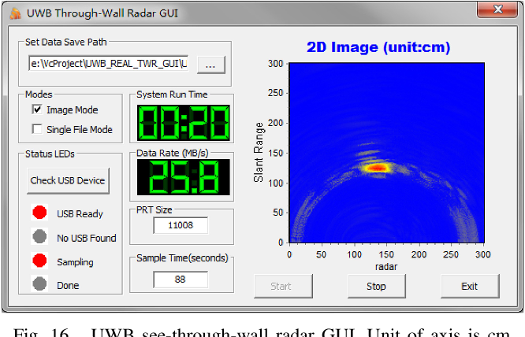

Python code utilizing LibIIO to create an FMCW radar.

Structure:

config.py:
    - @dataclass RadarConfig with every parameters (fc, bw, T, reps, fs, gains, CFAR params, isolation_db…)

sdr.py: 
    - @class AntSDR LibIIO API calls

capture.py:
    - @class CaptureThread: continuous read of Rx

processing.py:
    - @class ProcessingThread: does the FMCW radar DSP
    - TODO refactor the soft_model.py

gui.py:
    - pyqtgraph ImageItem for the RD map + a ScatterPlotItem for detections. A QTimer at ~30 Hz pulls from results_queue and updates. All Qt widget access happens on the GUI thread i.e. never touching widgets from the worker threads.

app.py:
    - config, AntSDR inst, queues and __main__.

Idea:

